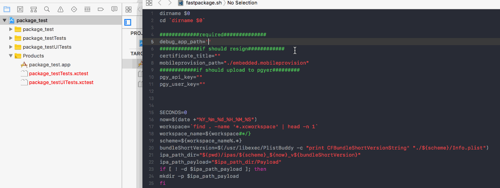
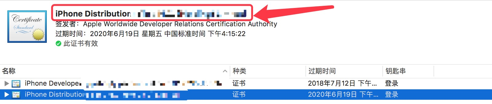

 iOS快速打包发布脚本
====================
使用
=================
### 快速打包
1. 将脚本文件放在与工程`xcodeproj`同一目录，修改参数

2. 用终端打开改脚本即可。生成的ipa包在 `./ipas`下。

### 重签名
1. 重签名需要`p12`证书和`embedded.mobileprovision` 描述文件。 
2. 将描述文件重命名为`embedded.mobileprovision`放在与该脚本同一目录下, 修改脚本中的`certificate_title`为证书名称

3. 用终端打开该脚本文件。

### 上传蒲公英
1. 修改`pgy_api_key`和`pgy_user_key`
2. 用终端打开该脚本文件

说明
==============
1. 生成的包为Debug包
2. 若不能用终端打开该脚本，使用`chmod 755`提权该脚本
3. 重签名的描述文件要与证书名称对应
